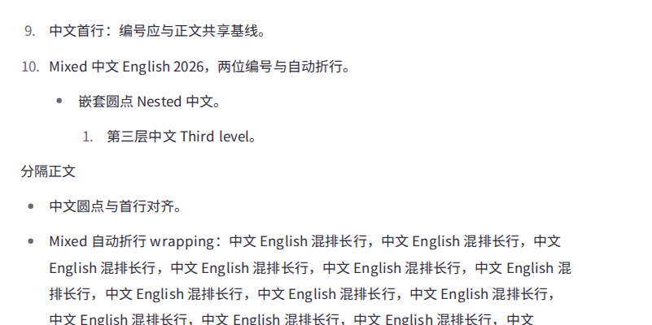
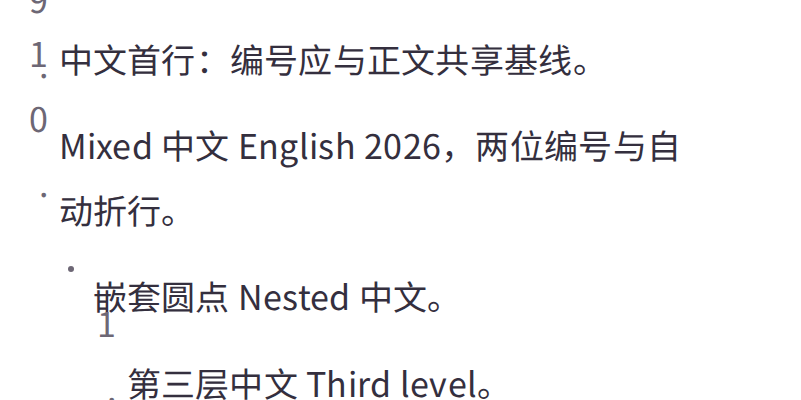
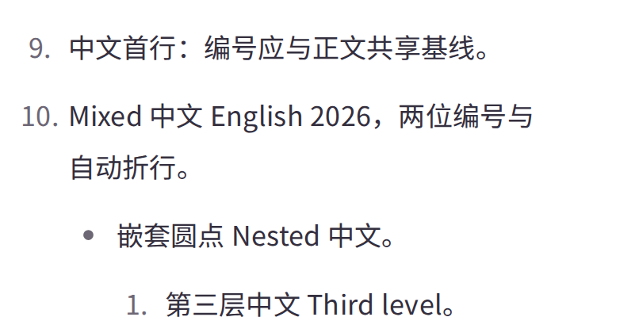
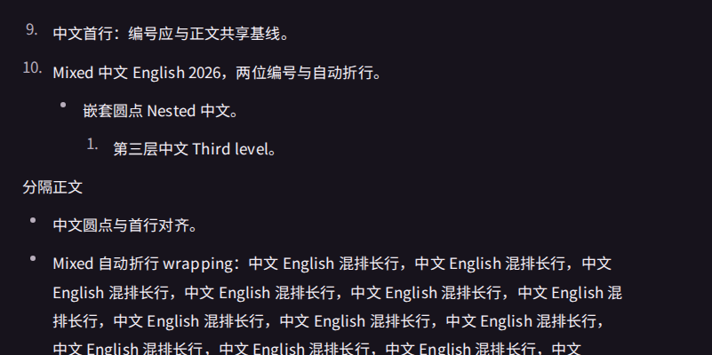
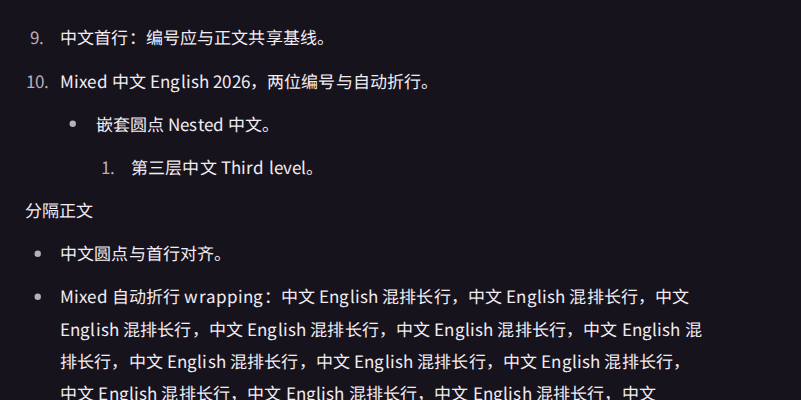
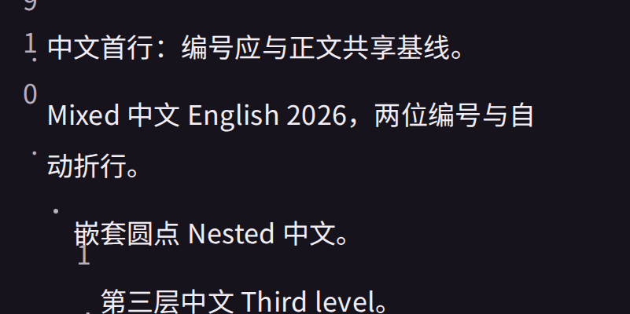
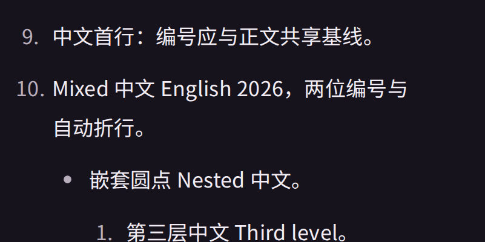

# 编辑态列表标记基线复验

旧应用基线：Web `356d7cb46813a3e52fb8b9bdf09fdb01b23ce59a`，构建 `ouZS2wnD4QC1XBBzuRAkZ`。候选浏览器构建：`ttxyDZsiFqwvj3HOrGa7V`。正文采用本仓库锁定 Foundation v6.9.0 的打包字体；已核对正式 v6.10.0，字体及 Web Token 未变化。Chromium 实际字体查询确认正文和编号均使用自定义 Noto Sans SC 字体。

旧版 Chromium 八组均复现偏差。候选 Chromium、Firefox、WebKit 各八组全部通过，共 24 组、168 个标记位置；包含中文、中英混排、两位编号、三层嵌套和自动折行，亮暗主题各四档字号。缩放限定于正文文字（100%/125%/150%/200%），不把全站容器放大和文字缩放混为一项。

编号比较同字体/字号/字重的首字字体框顶边差，对应首行基线差；圆点比较 SVG 中心与正文第一行行框中心。测量不插入 DOM 探针。最大绝对偏差如下，旧版方向均为偏高；大字号编号被固定宽高挤成多行，因此其偏差大于圆点。

| 正文字号 | 旧编号最大偏差 | 旧圆点最大偏差 | 候选三浏览器最大偏差 |
| --- | --- | --- | --- |
| 17px | 5.578px | 5.590px | 0.012px |
| 21.25px | 31.172px | 10.987px | 0.003px |
| 25.5px | 40.594px | 16.385px | 0.010px |
| 34px | 91.766px | 27.180px | 0.008px |

逐项数字见 [测量摘要](./metrics-summary.json)。回归还断言编号始终单行、真实三层树存在、长行换行且编辑器无横向溢出。发布态继续使用原生 decimal/disc 标记，截图用于核对两态表现。

| 场景 | 修复前 | 候选 |
| --- | --- | --- |
| 亮色 100% |  |  |
| 亮色 200% |  |  |
| 黑夜 100% |  |  |
| 黑夜 200% |  |  |

复验：先运行仓库 `pnpm check`，再运行 `E2E_BROWSER_MATRIX=true pnpm test:e2e:candidate e2e/editor-alignment-compatibility.spec.ts --grep '列表标记基线'`。用例将输出编辑态首屏、滚动后的内容、阅读态截图，以及测量 JSON；三种浏览器均需已安装。候选测试只连接本机并使用受控 API 响应。

完整原始证据保留在 VPS `/srv/wenyousite/artifacts/editor-list-baseline-20260911/verified-before/` 与 `verified-after/`。本报告是自动验收证据，负责人浏览器验收仍待完成；不代表原列表契约、空块整改或移动端任务已验收。
